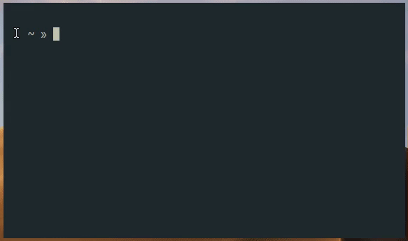

  <h1>crow 🦀🦇</h1>

  

    <strong>crow manages files - mostly .dot files</strong>
  
  _(Pretend the bat is a crow)_
  
  

  &nbsp;&nbsp;&nbsp;&nbsp;&nbsp;&nbsp;

---

#### *Note - this is not currently in a state for other users, if you somehow manage to stumble upon this. It is currently just a personal project*

---

### Workflow:
#### To add a file to crow for management:
- `crow -a YourAlias -s ~/path/to/your/file.conf`
- After this has completed you can open this file with `crow -a YourAlias`

This feature is essentially like adding an alias to your .bashrc

It adds alias entries to a file at ~/.config/crow/ named 'crowfile'

Formatted like so: `-<<<>  YourAlias: /path/to/your/alias`

----
#### To pull those files into your "nest":
- `crow -P YourAlias`

This will create the necessary subfolders for the config file at '~/nest' and move the file listed for the alias to the appropriate subfolder.

This is where [gnustow](https://www.gnu.org/software/stow/) 📦 comes into play. Simply `cd ~/nest` and `stow YourAlias`

This should create a symlink where the file was originally located, keeping your configuration intact without having to make a copy in another folder. 

After this, simply `git init` your nest, and manage through github, gitlab, etc.
